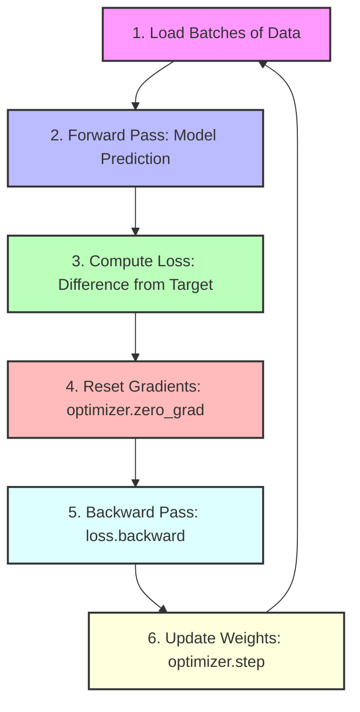

# Module 2: Deep Learning with PyTorch 🔥

This module introduces Deep Learning (DL) and explains how to build and train artificial neural networks from scratch using **PyTorch**, the leading framework for modern AI research and industry.

---

## 🧠 Core Concepts

### 1. What is Deep Learning?
Deep Learning is a subset of Machine Learning that uses multi-layered artificial neural networks (hence the term "deep") to learn representations of data. While classical ML relies on manual feature engineering, deep learning networks learn to extract feature representations directly from raw inputs.

### 2. Why PyTorch?
*   **Tensors & GPU Acceleration:** Similar to NumPy arrays, but can be loaded onto GPUs (Graphics Processing Units) to accelerate math by 10x-100x.
*   **Dynamic Computational Graphs (Autograd):** Calculates gradients (derivatives) automatically using backpropagation, making custom neural architectures easy to build.
*   **Pythonic Design:** Integrates perfectly with standard Python constructs and debugging environments.

---

## 📐 The PyTorch Neural Network Training Loop

Every deep learning model in PyTorch follows a strict sequence of steps during training. Understanding this flow is essential:

1.  **Forward Pass:** Feed inputs into the network to obtain predictions.
    `y_pred = model(inputs)`
2.  **Compute Loss:** Compare predictions with correct target labels using a loss function (e.g., Mean Squared Error or Cross-Entropy).
    `loss = criterion(y_pred, targets)`
3.  **Zero Gradients:** Reset accumulated gradients from the previous step.
    `optimizer.zero_grad()`
4.  **Backward Pass (Backpropagation):** Calculate gradients of the loss with respect to all trainable weights.
    `loss.backward()`
5.  **Optimizer Step:** Adjust weights to minimize the loss.
    `optimizer.step()`

---

## 🛠️ Python Implementation Files

1.  **`pytorch_basics.py`**: Explains PyTorch tensors, creating them from scratch or from lists/numpy, math operations, moving tensors between CPU and GPU, and PyTorch's automatic differentiation system (`autograd`).
2.  **`neural_network.py`**: Builds a multi-layer perceptron (MLP) classification network using `nn.Module` to solve a non-linear classification problem (a concentric circle dataset), demonstrating the training loop and showing results.
