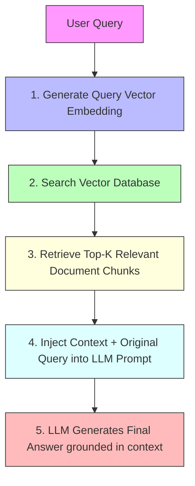

# Module 5: Generative AI & Large Language Models (LLMs) 🤖

This module covers the principles of Generative AI, prompt engineering, vector databases, and constructing **Retrieval-Augmented Generation (RAG)** systems to augment models with custom/private knowledge.

---

## 💡 Core Concepts

### 1. What are LLMs?
Large Language Models (LLMs) are deep learning models (typically based on decoder-only Transformer architectures) trained on trillions of words. They predict the next token in a sequence, allowing them to write code, draft emails, translate, and reasoning.

### 2. Prompt Engineering
Prompt engineering is the practice of designing inputs for LLMs to maximize output quality:
*   **System Prompts:** Set the persona, rules, and guardrails for the assistant (e.g. *"You are a helpful database administrator. Answer only in SQL"*).
*   **Few-Shot Prompting:** Giving the model 2-3 examples of inputs and desired outputs in the prompt before the final query.
*   **Temperature:** Controls randomness (0.0 is deterministic and focused; 1.0 is creative and diverse).

### 3. Retrieval-Augmented Generation (RAG)
LLMs have limitations:
1.  **Knowledge Cutoff:** They don't know about facts past their training date.
2.  **Hallucinations:** They confidently state false facts.
3.  **Lack of Private Data Access:** They don't know your specific business files.

**RAG** solves this by searching a database for relevant passages *first*, then appending those passages to the prompt as context.

---

## 🛠️ Python Implementation Files

1.  **`api_inference.py`**: Explains how to invoke Gemini and OpenAI APIs, handle System/User prompts, configure parameters (temperature), and retrieve structured JSON outputs. Uses dummy fallbacks for testing without API keys.
2.  **`simple_rag.py`**: Implements a complete local RAG system from scratch using a simple vector database simulation, computing embeddings, indexing articles, matching user queries semantically, and compiling the final LLM prompt.
