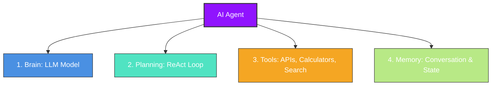

# Module 6: AI Agents & Workflows 🤖🕶️

An **AI Agent** is an autonomous system powered by an LLM that can perceive its environment, make decisions, execute actions using external tools, and learn from the results to achieve a specific goal.

---

## 💡 Core Concepts

### 1. Chains vs. Agents
*   **Chains:** Pre-determined, hardcoded sequences of steps. The user inputs data, it passes through prompt A, then model B, then parser C. It is predictable and linear.
*   **Agents:** Dynamic. The LLM acts as the central controller ("brain") deciding which steps to take next, which tools to use, and when the task is complete. It can loop, retry, and handle edge cases on its own.

### 2. Core Agent Architecture

An AI Agent consists of four main pillars:

1.  **Brain (LLM):** Understands inputs, makes logical inferences, and formats outputs.
2.  **Planning (Reasoning):** The reasoning loop. The most famous is the **ReAct (Reason + Act)** pattern:
    *   *Thought:* Analyze current progress and decide what to do next.
    *   *Action:* Choose a tool and construct its input parameters.
    *   *Observation:* Examine the results returned by the tool.
    *   *Repeat* until the goal is achieved.
3.  **Tools (Actions):** Functions the agent can execute. Examples: database connections, calculator execution, web searching, or sending an email.
4.  **Memory:**
    *   *Short-term Memory:* Keeps track of actions taken in the current execution loop.
    *   *Long-term Memory:* Preserves context across different chat sessions.

### 3. Agent Frameworks
*   **LangGraph:** Built on top of LangChain. Represents agents as state machines (graphs with nodes and edges), which makes it excellent for defining structured multi-agent workflows.
*   **CrewAI:** Role-playing multi-agent framework. You define agents with specific roles, goals, and backstories (e.g. "Senior Researcher", "Technical Writer") and assign them sequential or hierarchical tasks.

---

## 🛠️ Python Implementation Files

1.  **`simple_agent.py`**: Implements a complete **ReAct Agent Loop from scratch** without using any complex external library. It defines simple math tools, a system prompt, and a loop that parses thoughts, invokes python tools, and feeds results back to the reasoning chain until a final answer is compiled.
