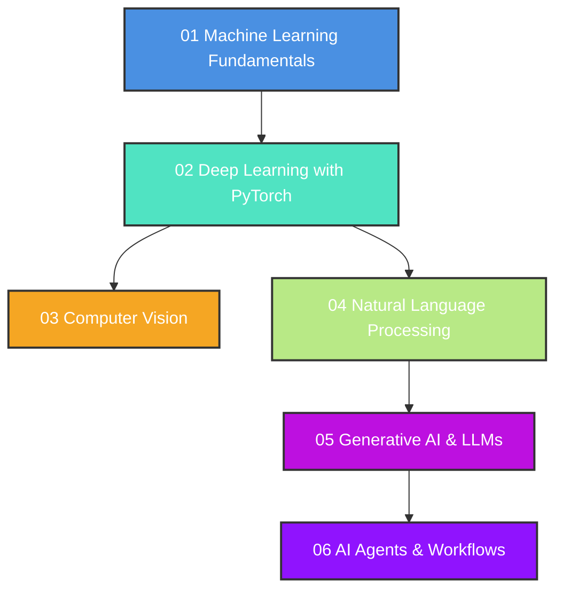

# Python AI Learning Hub 🚀

Welcome to the **Python AI Learning Hub**. This repository is designed to take you from a absolute beginner to an advanced practitioner in Artificial Intelligence, Machine Learning, Deep Learning, Natural Language Processing, Computer Vision, Generative AI (LLMs), and AI Agents.

---

## 🗺️ Roadmap & Curriculum

This hub is divided into **6 logical modules**, each containing interactive code examples, theoretical explanations, and library overviews.



| Module | Focus | Key Libraries | Core Concepts |
| :--- | :--- | :--- | :--- |
| **[01 Machine Learning Fundamentals](./01_machine_learning_fundamentals)** | Core ML, Math, & Data | `numpy`, `pandas`, `scikit-learn` | Data preprocessing, Regression, Classification, Clustering, Metrics |
| **[02 Deep Learning with PyTorch](./02_deep_learning_pytorch)** | Neural Networks from Scratch | `torch` | Tensors, Autograd, MLP (Multi-Layer Perceptrons), Optimizers, Backpropagation |
| **[03 Computer Vision](./03_computer_vision)** | Image Processing & CNNs | `opencv-python`, `pillow`, `torchvision` | Image manipulation, Convolutions, CNN architectures, Digit classification |
| **[04 Natural Language Processing](./04_natural_language_processing)** | Text & Sequence Modeling | `nltk`, `spacy`, `transformers` | Tokenization, Embeddings, TF-IDF, Sentiment analysis, Attention mechanisms |
| **[05 Generative AI & LLMs](./05_generative_ai_llms)** | LLMs, Vector DBs, & RAG | `openai`, `google-generativeai`, `chromadb`, `faiss-cpu`, `langchain` | Prompt engineering, Vector embeddings, Semantic search, Retrieval-Augmented Gen |
| **[06 AI Agents](./06_ai_agents)** | Autonomous Workflows | `langgraph`, `crewai` | Tool calling, Agentic loops, State machines, Multi-agent collaboration |

---

## 🛠️ Essential AI Libraries & Frameworks Reference

Below is a cheat sheet of the industry-standard libraries that you will learn and use in the field of AI:

### 1. Data Science & Math Foundations
*   **NumPy (`numpy`)**
    *   *What is it:* High-performance multi-dimensional array processing and mathematical tools.
    *   *Uses:* Matrix calculations, linear algebra, generating datasets.
    *   *Install:* `pip install numpy`
*   **Pandas (`pandas`)**
    *   *What is it:* Data structures and data analysis tools for tabular data.
    *   *Uses:* Data cleaning, reading CSV/Excel, filtering, grouping, and feature engineering.
    *   *Install:* `pip install pandas`
*   **Matplotlib & Seaborn (`matplotlib`, `seaborn`)**
    *   *What is it:* Data visualization libraries.
    *   *Uses:* Plotting trends, distribution graphs, correlation heatmaps, and confusion matrices.
    *   *Install:* `pip install matplotlib seaborn`

### 2. Classical Machine Learning
*   **Scikit-Learn (`scikit-learn`)**
    *   *What is it:* The standard library for predictive data analysis and classical machine learning.
    *   *Uses:* Implementing regression, classification, clustering, dimension reduction, and train-test splitting.
    *   *Install:* `pip install scikit-learn`

### 3. Deep Learning Frameworks
*   **PyTorch (`torch`)**
    *   *What is it:* An open-source, tensor-based deep learning library developed by Meta AI.
    *   *Uses:* Building deep neural networks, custom gradient calculations (Autograd), GPU accelerated training.
    *   *Install:* `pip install torch torchvision torchaudio`
*   **TensorFlow & Keras (`tensorflow`)**
    *   *What is it:* A comprehensive ecosystem for machine learning developed by Google. Keras is its high-level API.
    *   *Uses:* Large-scale model training, production deployments, mobile-oriented model serving.
    *   *Install:* `pip install tensorflow`

### 4. Computer Vision (CV)
*   **OpenCV (`opencv-python`)**
    *   *What is it:* A massive library for real-time computer vision and image processing.
    *   *Uses:* Image transformations, thresholding, edge detection, video capturing, object tracking.
    *   *Install:* `pip install opencv-python`
*   **Pillow (`Pillow`)**
    *   *What is it:* Python Imaging Library fork.
    *   *Uses:* Simple image opening, resizing, saving, and format conversions.
    *   *Install:* `pip install Pillow`

### 5. Natural Language Processing (NLP)
*   **NLTK / SpaCy (`nltk`, `spacy`)**
    *   *What is it:* Text processing libraries.
    *   *Uses:* Tokenization, part-of-speech tagging, named entity recognition (NER), lemmatization.
    *   *Install:* `pip install nltk spacy` (SpaCy also requires model downloads: `python -m spacy download en_core_web_sm`)
*   **Hugging Face Transformers (`transformers`)**
    *   *What is it:* Access to thousands of state-of-the-art pretrained models (BERT, GPT, RoBERTa, T5, etc.).
    *   *Uses:* Sentiment analysis, translation, summarization, text generation, local model loading.
    *   *Install:* `pip install transformers torch`

### 6. Generative AI, LLMs, & Orchestration
*   **OpenAI / Gemini / Anthropic SDKs**
    *   *What is it:* Official client libraries for commercial LLMs.
    *   *Uses:* Executing chat queries, calling tool-use functions, embedding generation.
    *   *Install:* `pip install openai google-generativeai anthropic`
*   **ChromaDB / FAISS (`chromadb`, `faiss-cpu`)**
    *   *What is it:* Vector stores / similarity search engines.
    *   *Uses:* Storing text embeddings, performing semantic search, powering RAG workflows.
    *   *Install:* `pip install chromadb faiss-cpu`
*   **LangChain / LlamaIndex (`langchain`, `llama-index`)**
    *   *What is it:* Frameworks for building LLM-powered applications.
    *   *Uses:* Formatting prompts, chaining API calls, building complex memory-based chat applications.
    *   *Install:* `pip install langchain llama-index`
*   **LangGraph / CrewAI / AutoGen**
    *   *What is it:* Multi-agent orchestrators.
    *   *Uses:* Constructing stateful, multi-agent systems with tool authorization, loop control, and task delegation.
    *   *Install:* `pip install langgraph crewai`

---

## ⚙️ How to Set Up Your Learning Environment

Follow these steps to run the examples in this repository.

### 1. Create a Virtual Environment
Using a virtual environment keeps your global Python installation clean and avoids dependency conflicts.

```bash
# Navigate to the workspace folder
cd python_ai_learn

# Create the environment
python -m venv venv

# Activate it:
# Windows (PowerShell):
.\venv\Scripts\Activate.ps1
# Windows (CMD):
.\venv\Scripts\activate.bat
# Linux/macOS:
source venv/bin/activate
```

### 2. Install Dependencies
You can install all necessary packages for these lessons at once using the `requirements.txt` file:

```bash
pip install -r requirements.txt
```

---

Let's dive into the modules and start coding!
